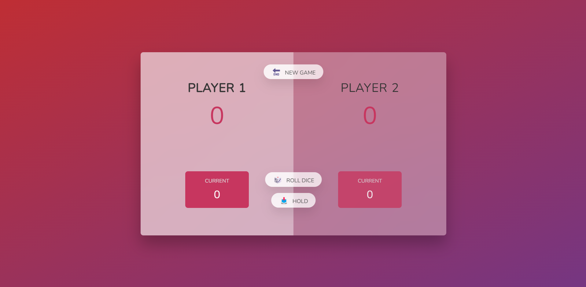

# Game

## Table of contents

- [Links](#links)
- [Overview](#overview)
- [The challenge](#the-challenge)
- [Screenshot](#screenshot)
- [My process](#my-process)
- [Built with](#built-with)
- [What I learned](#what-i-learned)

  # Links

## Overview

This project is a rolling dice game . And can be played by one user or two in the same time . The player should roll the dice and gets a number, that number can be added to current score. For each new number rolled the program make's addition and and store it in the current number. Also the user can hold that number, and then the program switch to player number two.

Every time when is it rolled one the player loos all the current score and it then the next player turn.

To win the game the user should have 20 points.

## The challenge

Users should be able to:

- play the game by pressing the "Roll dice" button
- hold the current score if the user want
- start new game

## Screenshot

## My process

The files index.html and style.css I received from the current course in which I am learning named "The complete JavaScript", after that I start to build the functionality by selecting elements and store it in variables.

Then I start to create condition for "Roll Dice" button, by generating a random number using Math trunc and Math floor, also I choose to display the dice by manipulating style .css (show the hidden class).
Another condition was added to switch players

For "Hold" button the process contain:

- Adding the current score to active player
- Check if the player score is >=20
- Finish the game
- Switch to next player

Reset button "New Game", for this part a function is created and inside of it are passed all the variables with the initial value.

## Built with

- Semantic HTML5 markup
- CSS custom properties
- Flexbox
- JavaScript

## What I learned

I learned how to use Dom manipulation, how to use DRY principle, how to select and change variables value, what roll has "toggle class" and when to use it.
